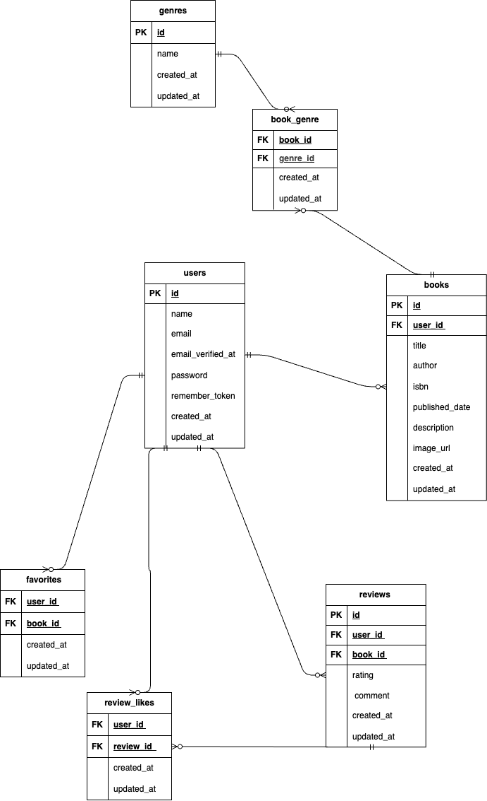

# BookShelf

## アプリケーション概要

BookShelfは、書籍の登録・レビュー・お気に入り・ランキングなどを管理できる書籍レビューアプリケーションです。

ユーザーは書籍情報を登録し、ジャンルの設定、レビュー投稿、お気に入り登録、レビューへのいいねなどを行うことができます。

## 主な機能

- 会員登録
- ログイン・ログアウト
- 書籍一覧表示
- 書籍詳細表示
- 書籍登録
- 書籍編集・削除
- ジャンル登録・編集・削除
- ジャンル別書籍表示
- レビュー投稿
- レビュー編集・削除
- レビューへのいいね
- お気に入り登録・解除
- お気に入り一覧表示
- レビュー平均評価によるランキング表示
- 公開APIによる書籍情報の取得・登録・更新・削除

## 使用技術

- PHP 8.5
- Laravel 10
- MySQL 8.4
- Laravel Fortify
- Laravel Sail
- Docker
- Vite
- Tailwind CSS
- Alpine.js

## 環境構築

### Dockerビルド

```bash
git clone <リポジトリURL>
cd bookshelf-app
```

```bash
docker run --rm \
    -u "$(id -u):$(id -g)" \
    -v "$(pwd):/var/www/html" \
    -w /var/www/html \
    laravelsail/php83-composer:latest \
    composer install --ignore-platform-reqs
```

### 環境設定

```bash
cp .env.example .env
```

`.env` のデータベース設定を環境に合わせて設定します。

```env
DB_CONNECTION=mysql
DB_HOST=mysql
DB_PORT=3306
DB_DATABASE=laravel
DB_USERNAME=sail
DB_PASSWORD=password
```

### アプリケーションキーの生成

```bash
./vendor/bin/sail up -d
./vendor/bin/sail artisan key:generate
```

### マイグレーション・シーディング

```bash
./vendor/bin/sail artisan migrate --seed
```

### フロントエンド

```bash
./vendor/bin/sail npm install
./vendor/bin/sail npm run dev
```

## URL

- アプリケーション  
  http://localhost

- phpMyAdmin  
  http://localhost:8080

## テスト用ログイン情報

```text
メールアドレス: yamada@example.com
パスワード: password
```

## ER図



## テーブル構成

- users
- books
- genres
- book_genre
- reviews
- favorites
- review_likes

## 公開API

### 書籍一覧取得

```text
GET /api/v1/books
```

キーワード検索、ジャンル絞り込み、ページネーションに対応しています。

### 書籍詳細取得

```text
GET /api/v1/books/{book}
```

### 書籍登録

```text
POST /api/v1/books
```

### 書籍更新

```text
PUT /api/v1/books/{book}
```

### 書籍削除

```text
DELETE /api/v1/books/{book}
```

## テスト

テストはLaravelのテスト機能を使用しています。

```bash
./vendor/bin/sail artisan test
```

カバレッジを確認する場合：

```bash
./vendor/bin/sail artisan test --coverage
```

テスト実行結果：

```text
97 passed
225 assertions
Coverage: 85.9%
```